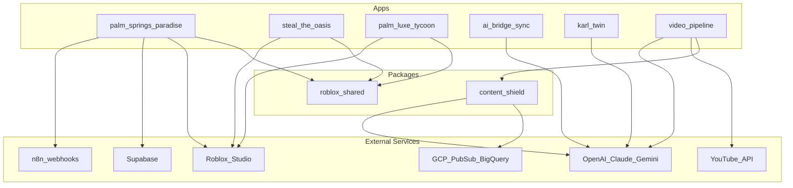

# Phase 2: Evaluation, Extraction Strategy, and SSO Architecture

**Date:** 2026-07-06  
**Prerequisite:** Phase 1 audit approved  
**Status:** Proposed — awaiting your review before Phase 3 migration

---

## What to Keep vs. Leave Behind

### Keep and Migrate

| Source | Destination | Rationale |
|--------|-------------|-----------|
| Palm Springs Paradise (`src/`) | `apps/palm-springs-paradise/` | Production-ready, 11k lines, active development |
| Iron-Forge-Studios | `apps/steal-the-oasis/` or merge into PSP | Unique heist/egg mechanics; shared MCM assets |
| Palm Luxe Tycoon | `apps/palm-luxe-tycoon/` | Unique cross-mode economy engine |
| content-shield (embedded) | `packages/content-shield/` | Most complete validation framework |
| Joshua 7 validators | Merge into `packages/content-shield/` | Prompt injection detector, CLI `j7` command |
| Faceless_Shorts | `apps/video-pipeline/` | Most mature video automation |
| yt-autopilot | Merge into `apps/video-pipeline/` | Provider abstraction for OpenAI path |
| AI Bridge Sync | `apps/ai-bridge-sync/` | Unique MCP sync product |
| karl-twin | `apps/karl-twin/` | Unique agent orchestration stack |
| Planning docs | `docs/` | Birch Lake brief, demo scope, capabilities ref |
| Cursor rules | `.cursor/rules/` | MCM art direction lock |

### Leave Behind

| Source | Rationale |
|--------|-----------|
| `FreeLance` | Empty repo, no default branch |
| `execution-test` (`server.js`) | Agent test artifact with intentional bugs |
| `node_modules/`, `.venv/`, `__pycache__/` | Regenerated from lockfiles |
| Duplicate Joshua 7 in `Content_Shield` + `joshua7` repos | Superseded by merged `packages/content-shield` |
| Gumroad/marketing paste files in Faceless_Shorts | Move to `docs/marketing/` if needed, not runtime code |
| `future/repos/` snapshot tree | Migration source only — do not ship as final layout |

---

## Proposed SSO Monorepo Architecture

```
iron-forge-sso/                          # New unified repository name (suggested)
├── .github/
│   └── workflows/
│       ├── ci-content-shield.yml        # Python: ruff, mypy, pytest
│       ├── ci-roblox.yml                # Selene, StyLua, Rojo build
│       ├── ci-video-pipeline.yml        # Python pipeline tests
│       ├── ci-ai-bridge-sync.yml        # Next.js lint, type-check, build
│       └── ci-karl-twin.yml             # Python pytest (keyless tier)
│
├── apps/
│   ├── palm-springs-paradise/         # Roblox: social life-sim (from Gemini-discovers-Diamonds)
│   │   ├── default.project.json
│   │   ├── README.md
│   │   └── src/
│   │       ├── server/
│   │       ├── client/
│   │       ├── shared/
│   │       └── gui/
│   │
│   ├── steal-the-oasis/                 # Roblox: heist/egg/trade (from Iron-Forge-Studios)
│   │   ├── default.project.json
│   │   └── src/
│   │
│   ├── palm-luxe-tycoon/                # Roblox: cross-mode economy (from 55-_AI_Intergration)
│   │   └── game/PalmLuxeTycoon/
│   │
│   ├── ai-bridge-sync/                  # Next.js 14 MCP dashboard (from 55-_AI_Intergration)
│   │   ├── package.json
│   │   ├── src/
│   │   └── eslint-plugin-no-sdk/
│   │
│   ├── karl-twin/                       # LangGraph agent (from 55-_AI_Intergration)
│   │   ├── pyproject.toml
│   │   ├── karl_twin/
│   │   └── infra/docker/
│   │
│   └── video-pipeline/                  # YouTube automation (Faceless_Shorts + yt-autopilot)
│       ├── pyproject.toml
│       ├── scripts/
│       │   ├── run_pipeline.py          # Canonical entry
│       │   └── auth_youtube.py
│       ├── config/
│       └── providers/
│           ├── script_gemini.py
│           ├── script_openai.py
│           ├── tts_elevenlabs.py
│           └── video_moviepy.py
│
├── packages/
│   ├── content-shield/                  # Python lib — canonical validation (merged)
│   │   ├── pyproject.toml
│   │   ├── src/content_shield/
│   │   │   ├── shields/                 # 8 pluggable shields
│   │   │   ├── agents/                  # Multi-provider AI
│   │   │   ├── resilience/              # Retry, CB, DLQ
│   │   │   ├── integrations/            # CMS connectors
│   │   │   ├── validators/              # ← ported from Joshua 7 (prompt injection, etc.)
│   │   │   └── cli/                     # ← `j7` / `joshua7` command from Joshua 7
│   │   ├── tests/
│   │   ├── examples/
│   │   └── infra/                       # Terraform, Docker, Grafana
│   │
│   └── roblox-shared/                   # Shared Luau modules across Roblox apps
│       ├── Remotes.lua                  # Unified remote registry pattern
│       ├── Util.lua                     # Deep copy, weighted random, formatting
│       ├── Constants.lua                # Shared enums (extract common subset)
│       ├── DataStoreWrapper.lua         # ProfileService-style persistence
│       ├── MCMBuilders.lua              # Shared part/procedural builders
│       └── ItemCatalog/                 # Shared furniture/plant definitions
│
├── docs/
│   ├── consolidation/                   # This audit (Phase 1 + 2)
│   ├── adventure/                       # Birch Lake content plan
│   ├── pipeline/                        # Thursday demo scope, video pipeline specs
│   ├── roblox/                          # Tycoon capabilities reference
│   └── marketing/                         # Gumroad copy, promotion lists (from Faceless_Shorts)
│
├── infra/
│   ├── docker/                          # Shared compose for local dev
│   ├── terraform/                       # GCP from content-shield
│   └── grafana/                         # Dashboard provisioning
│
├── tools/
│   └── agent-tests/                     # Optional: execution-test harness (isolated)
│
├── .cursor/
│   └── rules/
│       └── roblox-mcm.md
│
├── package.json                         # Root workspace (npm/pnpm workspaces)
├── pnpm-workspace.yaml                  # apps/ai-bridge-sync, tools/*
├── pyproject.toml                       # Root uv/poetry workspace for Python packages
├── Makefile                             # Top-level: dev, test, lint, build-all
└── README.md                            # SSO monorepo overview + per-app quick starts
```

---

## Dependency Graph



---

## Migration Priority (Phase 3 Order)

Migrate one logical chunk at a time, with your approval between each:

| Order | Chunk | Source | Risk | Effort |
|-------|-------|--------|------|--------|
| 1 | **Shared Roblox modules** | Extract from 3 games | Low | Medium |
| 2 | **content-shield merge** | content-shield + Joshua 7 validators | Medium | High |
| 3 | **Palm Springs Paradise** | Gemini-discovers-Diamonds `src/` | Low | Low (move + path updates) |
| 4 | **video-pipeline** | Faceless_Shorts + yt-autopilot | Medium | Medium |
| 5 | **steal-the-oasis** | Iron-Forge-Studios | Medium | Medium |
| 6 | **palm-luxe-tycoon** | 55-_AI_Intergration/game | Low | Low |
| 7 | **ai-bridge-sync** | 55-_AI_Intergration root | Low | Low |
| 8 | **karl-twin** | 55-_AI_Intergration/karl-twin | High (Docker deps) | Medium |
| 9 | **Docs + infra consolidation** | All repos | Low | Low |
| 10 | **CI/CD unification** | Per-app workflows → root `.github/` | Medium | Medium |

---

## Tooling Decisions

| Concern | Recommendation |
|---------|----------------|
| **JS/TS package manager** | pnpm workspaces (`apps/ai-bridge-sync`) |
| **Python package manager** | uv or pip editable installs (`packages/content-shield`, apps) |
| **Roblox sync** | Rojo v7 per app, shared package via ReplicatedStorage path mapping |
| **CI** | GitHub Actions with path filters (only run affected app CI) |
| **Secrets** | `.env.example` per app; never commit `.env` |
| **Render deploy** | `render.yaml` per app (karl-twin, content-shield API, video-pipeline) |

---

## Open Decisions for Your Review

1. **Repo name:** `iron-forge-sso`, `obhitting3-monorepo`, or keep `gemini-discovers-diamonds`?
2. **Roblox games:** Three separate apps vs. one unified game with feature modules?
3. **Joshua 7 CLI:** Keep `j7` alias or standardize on `content-shield validate`?
4. **Restore `future/` snapshot:** Checkout commit `4658b4d` snapshot into workspace for Phase 3, or clone live repos fresh?
5. **FreeLance repo:** Archive on GitHub or delete?

---

## Approval Checklist

- [ ] SSO folder tree approved
- [ ] Keep/leave-behind table approved
- [ ] Migration priority order approved
- [ ] Open decisions resolved
- [ ] Ready to begin Phase 3, Chunk 1 (shared Roblox modules)
