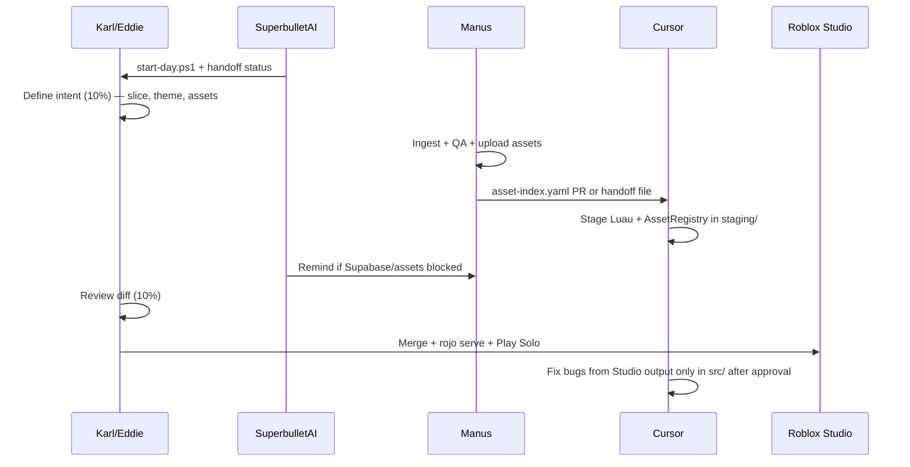

# Agent Lane Discipline — Cursor · Manus · SuperbulletAI

**Goal:** Zero tool overlap. One agent per concern so Karl and Eddie stay in flow state.

**Unified playbook:** [08-karl-automation-playbook.md](./08-karl-automation-playbook.md) · **Registry:** `staging/automation/agents.yaml` · **Router:** `AGENTS.md`

---

## Lane summary

| Lane | Agent | Environment | Owns |
|------|-------|-------------|------|
| **A — Logic** | **Cursor** (this agent) | Repo `src/`, `staging/`, Rojo, Luau | Gameplay, services, UI code, builders, config, tests, PRs |
| **B — Boundary** | **Manus** | Sandboxed APIs, KRLX filesystem, Roblox Open Cloud | Asset ingest, transcoding, bulk upload, webhooks, Supabase/n8n, secrets |
| **D — Orchestration** | **SuperbulletAI** | Karl PC schedules, n8n, checklists | Daily audits, agent dispatch, handoff reminders — **not** Luau or uploads |
| **C — Intent** | **Karl / Eddie** | Studio, Blender, GitHub merge | Creative direction, approvals, publish |

---

## Cursor — exclusive responsibilities

- Write and refactor **Luau** (server, client, shared, builders, UI).
- Maintain **Rojo** project (`default.project.json`, branch workflow).
- **ItemCatalog**, **GameConfig**, **Types**, **RemoteManager** contracts.
- Staged modules under `staging/` per 10-80-10.
- Code review responses, unit-style Studio test commands (`TestCommands`).
- Document merge paths in `docs/karlux/`.
- Map **approved** `rbxassetid` values into `AssetRegistry` (from Manus manifest).

**Cursor must NOT:**

- Call external paid APIs with production secrets (unless explicitly wired in repo and approved).
- Bulk-upload meshes to Roblox without a recorded manifest from Manus.
- Reorganize `vendor-imports/` on disk without an approved taxonomy doc.
- Publish the experience or overwrite Studio place files directly.

---

## Manus — exclusive responsibilities

- Receive packs in `vendor-imports/_incoming/` on **KRLX**.
- Run **asset QA**: triangle count, texture size, license file, MCM palette check vs `.cursor/rules/roblox-mcm.md`.
- **Upload** to Roblox (meshes, audio, decals) via Open Cloud / Studio automation.
- Maintain `vendor-imports/_manifests/asset-index.yaml` and `import-log.jsonl`.
- **Supabase** migrations, row backfills, cold-path batch jobs.
- **n8n / webhook** endpoint provisioning and credential rotation (not Luau business logic).
- **FFmpeg / image** processing (thumbnails, trailer pipeline — see `content-shield/`, `AUTOMATED_TYCOON_CAPABILITIES.md`).
- Quarantine rejects into `vendor-imports/_manifests/rejection/`.

**Manus must NOT:**

- Edit production `src/**/*.lua` (read-only for reference).
- Change `GameConfig` economy numbers or visual identity constants.
- Merge git branches or open PRs.
- Implement gameplay rules (authority stays server-side in Cursor-written services).

---

## SuperbulletAI — orchestration (Karl’s automation co-pilot)

- Run **`staging/scripts/karl-start-day.ps1`** (or remind Karl) at session start.
- Run **`staging/scripts/toolchain/audit-windows.ps1`** when toolchain drifts.
- Report status from **`staging/automation/agents.yaml`** phases (Supabase live, asset manifest, day-phase merge).
- **Dispatch** work:
  - → **Manus** when `asset-index.yaml` is missing, Supabase not pushed, or secrets not in Roblox.
  - → **Cursor** when Studio Output shows Luau errors or `staging/` is ahead of `src/`.
- Optional: trigger **n8n** flows documented in `WebhookClient` / `AUTOMATED_TYCOON_CAPABILITIES.md`.

**SuperbulletAI must NOT:**

- Edit `src/**/*.lua` or merge git branches (use **Cursor** + Karl approval).
- Upload Roblox assets or run `supabase db push` without repo migrations (**Manus**).
- Override KarLux 10-80-10 merge decisions.

---

## Toolchain ownership (Rokit / Wally / StyLua / Darklua / Remodel / Tarmac)

| Tool | Cursor | Manus | Karl/Eddie |
|------|--------|-------|------------|
| Rokit / Aftman pins | Maintain `rokit.toml` / `aftman.toml` PRs | Run `rokit install` on KRLX | Approve version bumps |
| Wally | Edit `wally.toml`, commit `wally.lock` | — | Approve new dependencies |
| StyLua / Darklua | Config + format in PRs | — | — |
| Rojo | `default.project.json`, `src/` | — | Play Solo in Studio |
| Tarmac | Merge `GeneratedAssets.lua` → `AssetRegistry` | Run `tarmac sync`, fill `vendor-imports/` | Provide `TARMAC_AUTH` |
| Remodel | Maintain `remodel/*.lua` drivers | Optional CI runner | **Only** run `publish-staging.lua` |
| Git | Branches, PRs | — | Merge to `main` |

| **Cursor / VS Code** | Shared `.vscode`, Luau edits, PRs | — | Install extensions, Play Solo |
| **Roblox Studio** | World polish, mesh import UI, publish | — | Rojo connect, HTTP enabled |
| **Blender** | Mesh authoring | Export to `vendor-imports/` | Art direction sign-off |
| **Supabase** | Schema migrations, dashboard, advisors | `supabase db push`, secrets | Project ownership, RLS review |

Full setup: [04-roblox-toolchain.md](./04-roblox-toolchain.md) · [05-unified-dev-stack.md](./05-unified-dev-stack.md)

---

## Handoff contracts (the only overlap points)

These files are the **API between lanes**:

| Artifact | Producer | Consumer |
|----------|----------|----------|
| `vendor-imports/_manifests/asset-index.yaml` | Manus | Cursor → `AssetRegistry` |
| `docs/karlux/01-asset-taxonomy-tree.md` | Cursor (draft) | Manus (physical sort) |
| `staging/src/shared/AssetRegistry.lua` | Cursor | Karl/Eddie merge → `src/` |
| `GameConfig.Remotes` names | Cursor | Both (frozen contract) |
| Webhook URLs / Supabase keys | Manus (env) | Cursor (read via Secrets mock) |
| Daily automation runbook | SuperbulletAI | Karl (start-day script) |

---

## Session workflow (typical sprint)

---

## Escalation rules

| Situation | Route to |
|-----------|----------|
| Wrong rbxassetid / missing mesh | Manus (re-upload) |
| Exploit / economy bug | Cursor |
| Sky color / two-story home | Karl (design) + Cursor fix builders |
| Supabase down | Manus infra; Cursor ensures DataStore fallback (already in PersistenceService) |
| Scope creep on Thursday demo | Karl — check `docs/thursday-demo-scope.md` |

---

## Flow-state protection

- **One active lane per task ticket** (Linear/Notion): label `cursor` or `manus`, never both.
- **No parallel edits** to the same slug in ItemCatalog and asset-index.
- **Staging first:** all Cursor deliverables land in `staging/` until explicit "merge approved" from Karl or Eddie.
