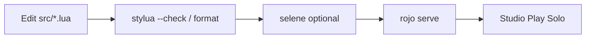

# Roblox Toolchain — KarLux / KRLX Standard

**Stack:** Rokit (tool pins) · Wally (Luau packages) · StyLua · Darklua · Rojo · Remodel · Tarmac · Git

All config files live in **`staging/toolchain/`** until Karl/Eddie promote to repo root (10-80-10).

---

## Tool roles

| Tool | Role in Palm Springs Paradise | Lane |
|------|------------------------------|------|
| **Rokit** (or Aftman) | Pin exact CLI versions: Rojo, Wally, StyLua, Darklua, Remodel, Tarmac | Shared — `rokit install` on KRLX |
| **Wally** | External Luau libraries → `Packages/` (ProfileService, utilities, test libs) | Cursor adds deps; lockfile committed after approval |
| **StyLua** | Format all `.lua` before commit / CI | Cursor |
| **Darklua** | Pre-sync transform: strip dev comments, optional minify for release builds | Cursor (config); Manus does not edit rules |
| **Rojo v7** | Filesystem ↔ DataModel sync; `rojo build` → `.rbxlx` | Cursor |
| **Git** | Source of truth; bypass Studio cloud save | Karl/Eddie + Cursor PRs |
| **Remodel** | Headless `.rbxl` / `.rbxm` ops, publish pipelines without Studio UI | Manus runs approved scripts; Cursor maintains `.lua` drivers |
| **Tarmac** | Upload local audio/images/meshes → rbxassetid; emit constants into Luau | Manus runs upload; Cursor merges generated registry |

---

## KRLX one-time setup

```bash
# 1. Install Rokit (preferred) — https://github.com/rojo-rbx/rokit
curl -sSf https://raw.githubusercontent.com/rojo-rbx/rokit/main/scripts/install.sh | bash

cd ~/Desktop/Roblox/PalmSprings   # or your clone path
git checkout cursor/karlux-foundation-292d   # until merged to main

# 2. Promote toolchain files from staging/toolchain/ to repo root (after approval)
#    OR symlink:  ln -sf staging/toolchain/rokit.toml rokit.toml  (temporary)

rokit install          # downloads pinned tools into .rokit/bin
export PATH="$PWD/.rokit/bin:$PATH"

# 3. Wally packages
wally install          # creates Packages/ from wally.toml

# 4. Verify
bash staging/scripts/toolchain/verify.sh
```

**Aftman fallback:** If Rokit is not installed, use `staging/toolchain/aftman.toml` — matches existing `setup.command` PATH (`~/.aftman/bin`).

---

## Daily developer loop (Cursor)



**Release build (no Studio):**

```bash
bash staging/scripts/toolchain/build-release.sh
# stylua → darklua (release rules) → rojo build → PalmSpringsParadise.rbxlx
```

---

## Asset pipeline (Tarmac + Manus)

```
vendor-imports/audio/...     ──Tarmac──►  rbxassetid
vendor-imports/textures/...  ──Tarmac──►  rbxassetid
         │
         └── generates ► src/shared/GeneratedAssets.lua (after merge)
                         └── AssetRegistry ingests IDs
```

1. Manus places vetted files under `vendor-imports/` per taxonomy.
2. `tarmac sync` (with `TARMAC_AUTH` / cookie from Roblox) uploads and refreshes `GeneratedAssets.lua`.
3. Cursor copies IDs into `AssetRegistry` or requires `AssetRegistry` to `require(GeneratedAssets)`.

---

## Remodel pipelines (headless deploy)

Scripts in `staging/toolchain/remodel/`:

| Script | Purpose |
|--------|---------|
| `extract-place.lua` | Dump place structure for audits |
| `inject-packages.lua` | Post-build: ensure Packages tree in place file |
| `publish-staging.lua` | **Gated** — requires `ROBLOX_API_KEY`; Karl runs only |

Remodel does **not** replace Rojo for day-to-day sync; it complements CI and production promotion.

---

## Wally ↔ Rojo wiring

After merge, `default.project.json` gains:

```json
"ReplicatedStorage": {
  "Packages": { "$path": "Packages" }
}
```

Server-only packages use `ServerPackages/` if added to `wally.toml` `[server-dependencies]`.

---

## Git ignore (add on merge)

```
Packages/
ServerPackages/
DevPackages/
.rokit/
.aftman/
.darklua/
*.rbxlx
*.rbxl
```

Commit **`wally.lock`** and **`rokit.toml`** / **`aftman.toml`** — lock versions for the team.

---

## Agent lane update (toolchain)

| Task | Owner |
|------|-------|
| `wally.toml` dependency changes | Cursor PR |
| `tarmac sync` / Open Cloud upload | Manus |
| `rokit.toml` version bumps | Cursor PR + Karl approval |
| `darklua` release rules | Cursor |
| `remodel publish-staging.lua` execution | Karl/Eddie only |
| `stylua` format on save | Cursor / local IDE |

See also: [02-agent-lane-discipline.md](./02-agent-lane-discipline.md)
