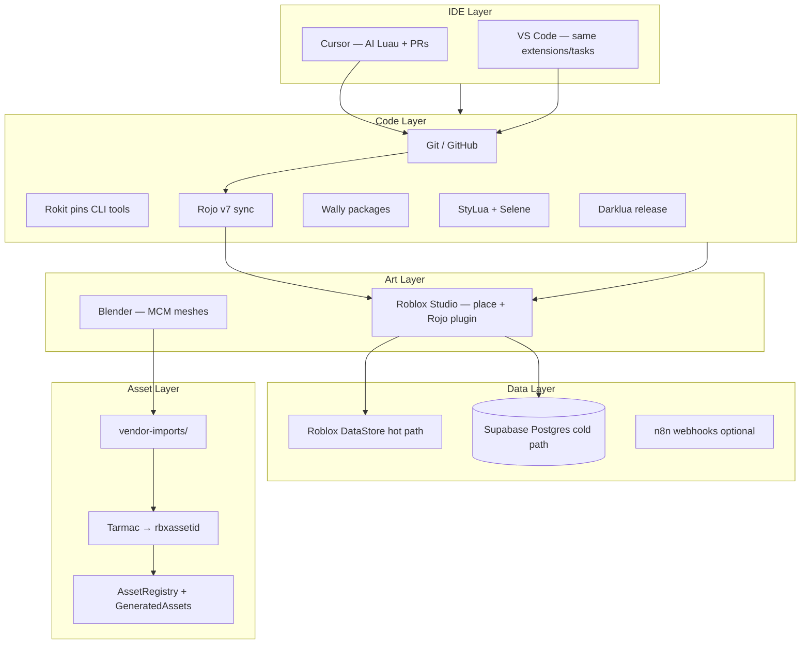

# Unified Dev Stack — What You Already Use + How It Connects

**Principals:** Karl · Eddie · **KRLX** workstation  
**Agents:** Cursor (logic) · Manus (boundary)  
**Game:** Palm Springs Paradise · KarLux 10-80-10

This document maps **your real toolchain** into one pipeline so nothing fights for ownership.

---

## Stack at a glance



---

## Your tools — defined roles

| Tool | You use it for | Repo touchpoints |
|------|----------------|------------------|
| **Cursor** | AI-assisted Luau, architecture, cloud PRs, rules | `.cursor/rules/`, `staging/`, `src/` via PR |
| **VS Code** | Same repo, lighter edits, extension marketplace | **Shared** `staging/editor/.vscode/` → promote to `.vscode/` |
| **Roblox Studio** | Play Solo, terrain polish, mesh import UI, publish UI | `PalmSpringsParadise.rbxlx`, Rojo plugin, `rojo serve` |
| **Blender** | Authoring furniture, plants, architecture shells | Export → `vendor-imports/` → Tarmac/Studio |
| **Supabase** | Cold persistence, analytics, JSONB layouts, fashion history | `SupabaseClient.lua`, `PersistenceService`, `staging/supabase/` |
| **Git** | Source of truth | GitHub; never rely on Studio cloud save |
| **Rokit/Aftman** | Locked CLI versions | `staging/toolchain/rokit.toml` |
| **Wally / Rojo / StyLua / Darklua / Tarmac / Remodel** | See [04-roblox-toolchain.md](./04-roblox-toolchain.md) | `staging/toolchain/` |

**Cursor vs VS Code:** Treat them as **one IDE layer**. Commit a single `.vscode/` folder; Cursor reads it automatically. Cursor-only agent context lives in `.cursor/rules/`.

---

## Daily workflow (low friction)

### Morning code (Cursor or VS Code on KRLX)

1. `rokit install` && `wally install` (once per machine)
2. Open repo in **Cursor** (features) or **VS Code** (quick edits)
3. Terminal: `rojo serve`
4. **Roblox Studio** → Rojo plugin → Connect
5. Edit `src/**/*.lua` → format on save (StyLua) → Selene squiggles
6. Play Solo; Supabase runs **mock** until Secrets set

### Art pass (Blender → game)

1. Model in **Blender** (see `staging/blender/README.md`)
2. Export FBX to `vendor-imports/...`
3. **Manus** runs Tarmac sync OR Studio import → rbxassetid
4. **Cursor** merges IDs into `AssetRegistry` / `GeneratedAssets.lua`

### Data / backend (Supabase)

1. Schema changes: **Supabase CLI** + `staging/supabase/migrations/`
2. Manus applies migrations; Cursor only changes Luau client
3. Production: Roblox **Secrets** `SUPABASE_URL`, `SUPABASE_ANON_KEY` (server-only)

---

## Supabase ↔ Roblox contract

| Path | Data | Owner |
|------|------|-------|
| **Hot** | Coins, prestige, plotId, inventory counts | DataStore / `ProfileServiceWrapper` |
| **Cold** | Furniture JSONB, garden history, fashion results, logs | `SupabaseClient` batch queue |

**Play Solo:** mock mode (no HTTP). **Live:** HttpService + Secrets.

Local dev (optional): `supabase start` on KRLX for Manus to test migrations — Roblox still points at cloud project for staging.

---

## Studio + Blender checklist

**Studio plugins (install once):**

- [Rojo](https://github.com/rojo-rbx/rojo) — required for sync
- Optional: [Avatar Importer](https://create.roblox.com/docs/art/accessories/importing) if using custom wearables

**Studio settings:**

- Game Settings → Security → **Allow HTTP Requests** (Supabase)
- Workspace → **StreamingEnabled** = true (already in `default.project.json`)

**Blender → Roblox:**

- Apply scale before export; target **&lt; 10k tris** per furniture piece (see part budget in README)
- Match MCM palette in materials preview (not enforced in engine until imported)

---

## Promote staged editor config

```bash
cp -r staging/editor/.vscode .vscode
# Cursor picks this up automatically
```

Optional: `cp staging/env/.env.example .env` (local only, never commit `.env`)

---

## Related docs

| Doc | Topic |
|-----|--------|
| [04-roblox-toolchain.md](./04-roblox-toolchain.md) | Rokit, Wally, Tarmac, etc. |
| [06-friction-reduction-additions.md](./06-friction-reduction-additions.md) | Tools we added to reduce UX friction |
| [02-agent-lane-discipline.md](./02-agent-lane-discipline.md) | Who touches what |
