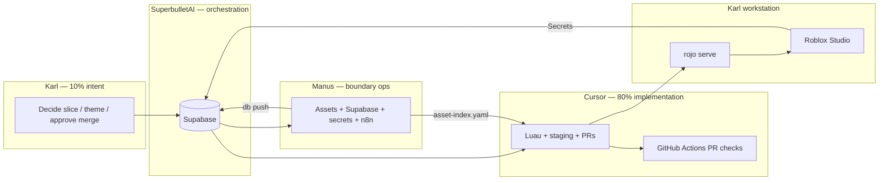

# Karl Automation Playbook — Palm Springs Paradise

**Goal:** One coordinated pipeline so Karl spends time on **intent and Play Solo**, not juggling tools.  
**Agents:** Karl/Eddie · **Cursor** · **Manus** · **SuperbulletAI** · Cloud Agent  
**Registry:** `staging/automation/agents.yaml` · **Router:** `AGENTS.md`

---

## Automation stack (how it fits together)



---

## What runs automatically today

| Automation | Trigger | Agent |
|------------|---------|--------|
| World build (terrain, El Paseo, garden, runway) | Play Solo | **Cursor** code in `src/` |
| Economy, plots, fashion events, test chat | Play Solo | **Cursor** |
| Supabase cold path | Play Solo | **Mock** until Manus + Secrets |
| DataStore | Play Solo | Live if **Studio API access** enabled |
| Toolchain verify | `verify.ps1` / start-day script | **SuperbulletAI** runbook |
| PR StyLua + Selene + Rojo build | GitHub (when workflow promoted) | **Cursor** via CI |
| Day/night loop | Not live in `src/` yet | **Cursor** `staging/` after Karl approves PR #24 |

---

## Karl’s daily routine (automated front door)

### Windows (one script)

```powershell
cd $env:USERPROFILE\Documents\Roblox\PalmSprings
powershell -ExecutionPolicy Bypass -File staging\scripts\karl-start-day.ps1
```

This script:

1. Puts **Rokit** `rojo` first on PATH  
2. Syncs `rokit.toml` / `wally.toml` from `staging/toolchain/`  
3. Runs `rokit install`, `wally install`  
4. Runs `verify.ps1` + `audit-windows.ps1`  
5. Prints **agent handoff status** (what Manus / Cursor / Supabase still owe)  
6. Reminds: **Rojo: Serve** → Studio Connect → `/help`

### Cursor task

**Ctrl+Shift+P** → **Tasks: Run Task** → **Karl: Start Dev Day** (same as the script above)

---

## Agent responsibilities (unified)

| Agent | When Karl uses it | Automates |
|-------|-------------------|-----------|
| **SuperbulletAI** | Start of day / weekly | Checklists, “who’s blocked,” n8n triggers, audit reminders |
| **Cursor** | Feature work, bugs | Luau, Rojo, `staging/`, PRs, docs |
| **Manus** | New meshes, DB, secrets | `vendor-imports/`, `supabase db push`, `.env`, uploads |
| **Cloud Agent** | Away from desk | Same as Cursor on GitHub branches |
| **Karl** | Creative + approve | Merge, publish, Experience Settings |

Full lanes: [02-agent-lane-discipline.md](./02-agent-lane-discipline.md)

### SuperbulletAI (orchestration lane)

**Purpose:** Karl’s **co-pilot for process**, not for writing `src/` or uploading assets.

**SuperbulletAI SHOULD:**

- Run or schedule `karl-start-day.ps1` and `audit-windows.ps1`
- Report: missing `asset-index.yaml`, stale `staging/` vs `src/`, open PR #24 items
- Open tickets / prompts for **Manus** (assets, Supabase) and **Cursor** (Luau bugs)
- Trigger **n8n** flows when configured (signup analytics, Modernism Week — see `WebhookClient`)

**SuperbulletAI MUST NOT:**

- Merge `staging/` → `src/` without Karl
- Edit production Luau (delegate to **Cursor**)
- Run `supabase db push` without migration files in repo (delegate to **Manus**)

Configure SuperbulletAI with read access to this repo + `staging/automation/agents.yaml`.

---

## Phased automation (what to turn on when)

### Phase A — Done: Dev loop ✅

- [x] Windows toolchain (Rokit, Rojo 7.4.4, Wally)  
- [x] `rojo serve` + Studio Connect  
- [x] Built place: `PalmSpringsDev.rbxlx`  
- [x] Server builds 362+ parts, `/help` works  
- [x] `Types.lua` fix on branch  

**Karl:** Run start-day script → Play Solo.

### Phase B — Supabase live (Manus + Karl)

| Step | Owner |
|------|--------|
| Create Supabase project | Manus / Karl |
| `supabase link` + `supabase db push` (`staging/supabase/migrations/`) | Manus |
| Fill `.env` from `staging/env/.env.example` | Manus |
| Roblox Secrets: `SUPABASE_URL`, `SUPABASE_ANON_KEY` | Manus / Karl |
| Experience: Allow HTTP | Karl (done) |
| Verify Output: not MOCK MODE | Karl Play Solo |

**Cursor:** No schema edits without migration files in `staging/supabase/`.

### Phase C — Asset pipeline (Manus → Cursor)

| Step | Owner |
|------|--------|
| Export Blender → `vendor-imports/_incoming/` | Karl / Eddie |
| QA + upload + `asset-index.yaml` | Manus |
| Merge `AssetRegistry` from staging per merge guide | Cursor PR |
| Replace placeholder sounds | Manus upload + Cursor IDs |

### Phase D — Game loop automation (Cursor + Karl approve)

| Step | Owner |
|------|--------|
| Review PR #24 | Karl / Eddie |
| Merge `CoreLoopService`, `DayPhaseConfig`, `DayPhaseController` | Cursor after approval |
| Patch `init.server.lua` / `init.client.lua` | Cursor (`staging/patches/`) |
| Play Solo: Morning / Afternoon / Evening | Karl verify |

See [03-vertical-slice-merge-guide.md](./03-vertical-slice-merge-guide.md).

### Phase E — CI + nightlies (optional)

| Step | Owner |
|------|--------|
| Promote `staging/ci/pr-checks.yml` → `.github/workflows/` | Cursor PR |
| SuperbulletAI: notify on failed PR checks | SuperbulletAI |

---

## Handoff prompts (copy to each agent)

### To Manus

```
Repo: Gemini-discovers-Diamonds @ cursor/karlux-foundation-292d
Tasks:
1. supabase db push from staging/supabase/migrations/
2. Populate vendor-imports/_manifests/asset-index.yaml from _incoming/
3. Set Roblox Secrets SUPABASE_URL + SUPABASE_ANON_KEY on Karl's experience
4. Do not edit src/**/*.lua
```

### To Cursor (cloud or local)

```
Branch: cursor/karlux-foundation-292d
Read AGENTS.md + docs/karlux/08-karl-automation-playbook.md
Scope: staging/ only until Karl approves merge of day-phase slice
```

### To SuperbulletAI

```
Daily: run staging/scripts/karl-start-day.ps1 on Karl's PC (or remind Karl)
Report: agents.yaml phase status + PR #24 checklist
Dispatch: Manus if asset-index empty; Cursor if Studio errors in Output
```

---

## Success criteria (Karl’s “automated game”)

| Check | How |
|-------|-----|
| One-command morning | `karl-start-day.ps1` exits 0 |
| World builds on Play | Output: `Server Ready!` + `Environment` in Workspace |
| Chat works | `/help`, `/coins 5000`, `/status` |
| Cold path (later) | Supabase not MOCK in Output |
| Day phases (later) | HUD shows Morning/Afternoon/Evening after merge |
| Assets (later) | Manifest drives real rbxassetids |

---

## Related docs

- [02-agent-lane-discipline.md](./02-agent-lane-discipline.md)  
- [05-unified-dev-stack.md](./05-unified-dev-stack.md)  
- [HANDOFF-condensed.md](./HANDOFF-condensed.md)  
- [staging/supabase/README.md](../../staging/supabase/README.md)  
- [AUTOMATED_TYCOON_CAPABILITIES.md](../../AUTOMATED_TYCOON_CAPABILITIES.md) (webhooks / broader automation ideas)
