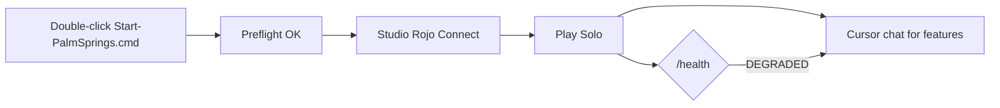

# Cross-Repo Success Hardening (OBHitting3)

**Goal:** Pull proven patterns from sibling repos so Palm Springs Paradise fails less often for Karl.

| Repo | Role | Patterns adopted here |
|------|------|------------------------|
| [Gemini-discovers-Diamonds](https://github.com/OBHitting3/Gemini-discovers-Diamonds) | **This game** (Palm Springs) | Rojo, KarLux 10-80-10, prompt-to-game |
| [content-shield](https://github.com/OBHitting3/Content_Shield) (vendored `content-shield/`) | AI validation, resilience | **Retry**, exponential backoff, re-queue on failure |
| [55-_AI_Intergration](https://github.com/OBHitting3/55-_AI_Intergration) | Next.js + `game/PalmLuxeTycoon` + `karl-twin` | Approval gates, agent lanes; Roblox slice parallels this repo |
| [karl-twin](https://github.com/OBHitting3/55-_AI_Intergration/tree/main/karl-twin) | Voice / multi-agent orchestration | **Non-negotiable invariants** → Karl never runs dangerous CLI; Cursor implements |
| [Iron-Forge-Studios](https://github.com/OBHitting3/Iron-Forge-Studios) | Studio marketing / activity | Brand entity alignment (KarLux LLC) |
| [joshua7](https://github.com/OBHitting3/joshua7) | Content Shield product fork | Same shield patterns as content-shield |
| [yt-autopilot](https://github.com/OBHitting3/yt-autopilot) | Video pipeline | Future: trailer webhook via `WebhookClient` |

---

## What we hardened in Palm Springs (this branch)

### 1. Resilience (from content-shield)

| Area | Module | Behavior |
|------|--------|----------|
| Webhooks | `src/shared/WebhookClient.lua` | 3× retry on HTTP POST |
| Supabase cold path | `PersistenceService` | 3× retry per queue item before re-queue |
| Shared helper | `src/shared/Resilience.lua` | `retryBool`, `retryResult` |

### 2. Bootstrap visibility (from karl-twin “verify” mindset)

| Area | Module | Behavior |
|------|--------|----------|
| Service init | `BootstrapHealth.lua` + `init.server.lua` | Every service recorded ok/fail |
| Play Solo | `/health` chat command | Karl pastes-friendly status |

### 3. Karl launcher (favor success, no PowerShell)

| Step | File |
|------|------|
| Preflight | `staging/scripts/karl-preflight.cmd` |
| Serve | `Start-PalmSprings.cmd` (calls preflight first) |

Checks: Rokit/Rojo on PATH, repo root, PropBuilder present, port 34872 warning.

### 4. CI / Eddie scripts (from content-shield CI + 55-AI)

| Fix | Detail |
|-----|--------|
| Symlink-safe toolchain copy | `rm` + `cp` (same as GitHub Actions) |
| `rokit install --no-trust-check` | Non-interactive CI + Eddie scripts |
| `selene --allow-warnings` | Only **errors** fail CI |
| `karl-start-day.ps1` | Symlink-safe copy, trust flag, PropBuilder check |

---

## Karl success loop (use every session)

1. **Start-PalmSprings.cmd** (preflight must pass)  
2. Studio → **Connect** → **Play**  
3. Chat: **`/health`** — all services should be OK  
4. Ideas → **Cursor** ([10-karl-prompt-to-game](./10-karl-prompt-to-game.md), [11-karl-prompt-to-3d](./11-karl-prompt-to-3d.md))  
5. If broken → paste Output + `/health` into Cursor (no terminal)

---

## Repo boundaries (still enforced)

| Work | Agent / repo |
|------|----------------|
| Luau, 3D procedural, CI | **Cursor** → this repo |
| FBX upload, `asset-index.yaml`, Supabase live | **Manus** → `vendor-imports/`, `staging/supabase/` |
| Voice / approval orchestration | **karl-twin** (separate product — not required for Play Solo) |
| Content moderation for published video | **content-shield** / joshua7 |

---

## Related docs

- [08-karl-automation-playbook.md](./08-karl-automation-playbook.md)  
- [11-karl-prompt-to-3d.md](./11-karl-prompt-to-3d.md)  
- `staging/automation/agents.yaml` → `cross_repo` section  
- `content-shield/ARCHITECTURE.md` (resilience design reference)
